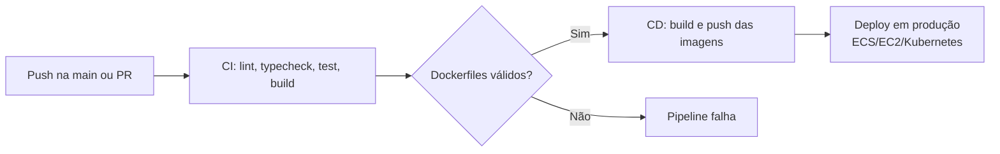

# CI/CD do Projeto Lavagem a Domicílio

Este documento descreve a pipeline de integração contínua (CI) e entrega contínua (CD) do projeto, implementada com **GitHub Actions**.

## Visão geral



## Workflows

### `ci.yml`

Acionado em:
- `push` para `main` ou `develop`
- `pull_request` para `main` ou `develop`

Jobs:

| Job | Descrição | Quando roda |
|---|---|---|
| `changes` | Detecta quais pacotes foram alterados | Sempre |
| `api` | Lint, typecheck, testes e build da API | Quando `services/api/` ou dependências comuns mudam |
| `admin-web` | Lint, typecheck e build do admin web | Quando `apps/admin-web/` ou dependências comuns mudam |
| `mobile` | `flutter analyze` nos apps cliente e lavador | Quando os apps Flutter mudam |
| `docker` | Valida se os Dockerfiles conseguem fazer build | Quando Dockerfiles ou compose mudam |

> **Nota:** lint e testes estão configurados como `continue-on-error: true` enquanto as configurações de ESLint e suites de teste não estão 100% finalizadas.

### `deploy.yml`

Acionado em:
- `push` para `main`
- `pull_request` para `main` (apenas build, sem push/deploy)

Jobs:

| Job | Descrição | Quando roda |
|---|---|---|
| `build-api` | Build da API como gate para deploy | Sempre |
| `build-admin-web` | Build do admin web como gate para deploy | Sempre |
| `docker-build-and-push` | Build e push das imagens Docker | Apenas na branch `main` |
| `deploy-aws` | *(comentado)* Deploy para AWS ECS | Apenas na branch `main`, após push |

## Imagens Docker geradas

- `${REGISTRY}/giucar/api:${GITHUB_SHA}`
- `${REGISTRY}/giucar/api:latest`
- `${REGISTRY}/giucar/api:main`
- `${REGISTRY}/giucar/admin-web:${GITHUB_SHA}`
- `${REGISTRY}/giucar/admin-web:latest`
- `${REGISTRY}/giucar/admin-web:main`

## Secrets necessários

Configure em `Settings > Secrets and variables > Actions`:

| Secret | Descrição | Usado em |
|---|---|---|
| `REGISTRY_USERNAME` | Usuário do Docker Hub ou registry escolhido | `deploy.yml` |
| `REGISTRY_PASSWORD` | Token de acesso do registry | `deploy.yml` |
| `AWS_ACCESS_KEY_ID` | Chave de acesso AWS | `deploy.yml` (deploy-aws) |
| `AWS_SECRET_ACCESS_KEY` | Segredo da AWS | `deploy.yml` (deploy-aws) |
| `AWS_REGION` | Região AWS (ex: `us-east-1`) | `deploy.yml` (deploy-aws) |

> **Nota:** o workflow `deploy.yml` usa `secrets.REGISTRY_USERNAME` e `secrets.REGISTRY_PASSWORD`. Se você preferir usar Docker Hub, basta colocar seu usuário e token. Para AWS ECR, ajuste `REGISTRY` para o endpoint do ECR e use o login apropriado.

## Como funciona o fluxo de informações

1. Desenvolvedor faz `git push` para a `main`.
2. GitHub Actions dispara `ci.yml` e `deploy.yml` em paralelo.
3. O CI instala dependências, gera Prisma Client, faz lint/typecheck/build e valida Dockerfiles.
4. Se tudo passar, o CD builda as imagens Docker e faz push para o registry.
5. (Opcional) O job `deploy-aws` atualiza as task definitions do ECS e força o deploy dos novos containers.

## Como testar localmente

Antes de subir o código, você pode validar o mesmo processo que o CI executa:

```bash
# CI - API
cd services/api
pnpm install
pnpm db:generate
pnpm build

# CI - Admin Web
cd ../apps/admin-web
pnpm install
pnpm build

# CI - Dockerfiles
cd ../..
docker build -f services/api/Dockerfile -t giucar/api:test .
docker build -f apps/admin-web/Dockerfile --build-arg API_URL=http://localhost:3000/api/v1 -t giucar/admin-web:test .
```

## Como habilitar deploy automático na AWS

1. Crie um cluster ECS com os serviços `giucar-api-service` e `giucar-admin-web-service`.
2. Crie as task definitions `giucar-api-task` e `giucar-admin-web-task`.
3. Configure os secrets `AWS_ACCESS_KEY_ID`, `AWS_SECRET_ACCESS_KEY` e `AWS_REGION`.
4. Descomente o job `deploy-aws` no arquivo `.github/workflows/deploy.yml`.
5. Ajuste os nomes do cluster, serviços e containeres conforme sua infraestrutura.

## Portas e acessos

- API: http://localhost:3000/api/v1
- Swagger: http://localhost:3000/docs
- Admin Web: http://localhost:3003

## Próximos passos recomendados

- Adicionar testes de integração na API.
- Configurar ESLint para API e admin-web e remover `continue-on-error: true`.
- Adicionar scan de vulnerabilidades nas imagens Docker (Trivy, Snyk).
- Criar ambientes de staging e produção separados.
- Adicionar notificações de sucesso/falha no Slack/Discord.

